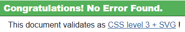

# Testing

## Manual Testing

### User Actions

#### Homepage:

| Feature tested  | Action             | Expected Outcome             | Result                    |
|-----------------|--------------------|------------------------------|---------------------------|
|Logo             |Left click          |Redirect to home page         |Pass                       |
|Shop Now Button  |Left click          |Go to products page           |Pass                       |
|Search Bar       |Left click or enter |Search for a specific product |Pass                       |
|Nav Links        |Left click          |Click link to link required   |Pass                       |

#### Products page:

| Feature tested   | Action     | Expected Outcome                                       | Result|
|------------------|------------|--------------------------------------------------------|-------|
|Logo              |Left click  |Redirect to home page                                   |Pass   |
|Page Filter       |Left click  |Show categories of selection                            |Pass   |
|Product           |Left click  |Redirects to product of choice details                  |Pass   |
|Edit product BTN  |Left click  |Opens edit product with fields filled with previous data|Pass   |
|Delete product BTN|Left click  |Trigger confirmation modal                              |Pass   |

#### Checkout page:

| Feature tested   | Action     | Expected Outcome                                       | Result|
|------------------|------------|--------------------------------------------------------|-------|
|Logo              |Left click  |Redirect to home page                                   |Pass   |
|Quantity buttons  |Left click  |Increase or decrease quantity                           |Pass   |
|Update BTN        |Left click  |Update quantity to selected choice                      |Pass   |
|Remove BTN        |Left click  |Remove item from bag                                    |Pass   |
|Keep shopping BTN |Left click  |Redirects to products page                              |Pass   |
|Checkout BTN      |Left click  |Redirects to Checkout page                              |Pass   |

#### Register page:

| Feature tested   | Action     | Expected Outcome                                       | Result|
|------------------|------------|--------------------------------------------------------|-------|
|Sign up BTN       |Left click  |Submit form                                             |Pass   |
|Back to login BTN |Left click  |Takes user back to login                                |Pass   |

#### Login page:

| Feature tested   | Action     | Expected Outcome                                       | Result|
|------------------|------------|--------------------------------------------------------|-------|
|Sign up BTN       |Left click  |Signs user in                                           |Pass   |
|Home BTN          |Left click  |Redirects user back to home page                        |Pass   |

#### Profile page: 

| Feature tested       | Action     | Expected Outcome                                       | Result|
|----------------------|------------|--------------------------------------------------------|-------|
|Update information BTN|Left click  |Updates user information with edited details            |Pass   |
|Order number          |Left click  |Allows user to view a past order                        |Pass   |

#### Catch cam page:

| Feature tested       | Action     | Expected Outcome                                       | Result|
|----------------------|------------|--------------------------------------------------------|-------|
|Add catch BTN         |Left click  |Redirects user to add catch form                        |Pass   |
|Edit BTN              |Left click  |Redirects to add catch form with previous data          |Pass   |
|Delete BTN            |Left click  |Triggers delete modal                                   |Fail   |

#### Site admin page:

| Feature tested       | Action     | Expected Outcome                                       | Result|
|----------------------|------------|--------------------------------------------------------|-------|
|Select image BTN      |Left click  |Opens files for user to add image                       |Pass   |
|Cancel BTN            |Left click  |Cancels entry                                           |Pass   |
|Add Product BTN       |Left click  |Sumbits the form to add product                         |Pass   |

### Validator testing:

Html:

Whilst passing this through the validator I had 1 error which was duplicate ID on navbars, I dont think this would cause any issues but I made adjustments to clear the error just for clean results. The change I made can be seen [here](https://github.com/LeeEd1/catch_master/commit/2b44b33b39a3ff35c7fcd4a9ab5e3cec4e7abae9).

I also had warnings showing with the attribute type="text/javascript", This also should cause any issues but I removed them just for clean results. The changes I made can be seen [here](https://github.com/LeeEd1/catch_master/commit/6f7f804007455f899c81732dc6f8a5069fcc4d03#diff-6140a05cf6f64320c906c5bf858179b0911493fb1bbe5f430844c8820f60cb2cL142)

Css:

Python:

I used [CI python linter](https://pep8ci.herokuapp.com/) throughout my project to correct any pep8 compliancy issues, I had quite a few issues with white space, length of code and trailing whitespace. This is documented in my commits with the adjustments.

JS:

After passing my js files through js hint I come accross one error which was a missing semi colon. The adjustment can be seen [here](https://github.com/LeeEd1/catch_master/commit/f0f97c8f1f1a941b7bee381e0b0d1a469727b4f0)

### Lighthouse testing:

Desktop Lighthouse report:

The desktop lighthouse scores are pretty much the same throughout, I have used the lowest score as an example.

Mobile Lighthouse reports:

Performance dips to between 60-70 on some other pages but I believe this is to do with rendering on mobile devices as these issues don't arise on desktop.

Throughout creating my project I was continuously using dev tools and lighthouse to check for any issues. The issues I fixed are documented in my commits under CHORE. Most of the issues were labels and some meta tags. I also have some issues with best practices however I believe this is down to stripe and cookies which I am not too worried about. 